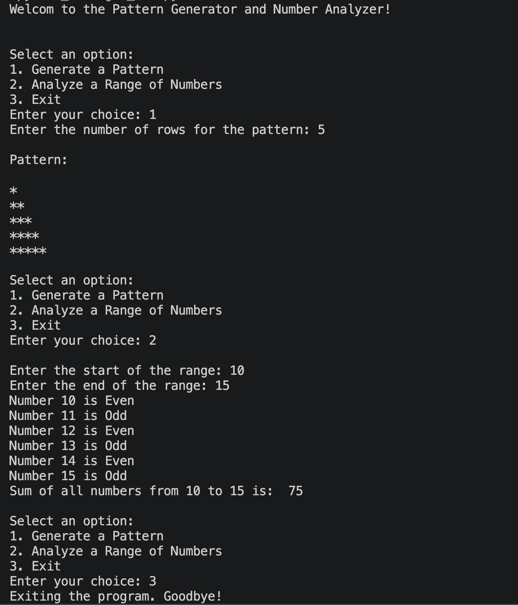

# 📦 Logic Box

Welcome to **Logic Box** 🚀  
A simple Python-based interactive console app that lets you:

✨ Generate patterns  
🔢 Analyze number ranges  
🧠 Practice basic logic building  

---

## 📸 Project Preview



---

## 🧩 Features

### 1️⃣ Pattern Generator
- Creates a triangle star pattern ⭐
- User defines number of rows
- Handles invalid inputs

### 2️⃣ Number Analyzer
- Checks whether numbers are Even or Odd
- Calculates total sum of a range
- Validates range input

### 3️⃣ Exit Option
- Cleanly exits the program 👋

---

## 🛠️ How It Works

The program runs in a loop and shows a menu:

```
1. Generate a Pattern
2. Analyze a Range of Numbers
3. Exit
```

Based on your input, it performs the selected task.

---

## 💻 Code Overview

- Uses Python `match-case` for menu selection
- Uses loops for pattern generation and number analysis
- Includes basic input validation

---

## ▶️ How to Run

1. Make sure you have Python installed 🐍
2. Run the file:

```
python logic_box.py
```

3. Follow the on-screen instructions

---

## 📂 Files Included

- `logic_box.py` → Main program
- `README.md` → Project documentation
- Screenshot → Output preview

---

## 🎯 Purpose

This project is great for:
- Beginners learning Python
- Practicing loops and conditions
- Understanding user input handling

---

## 🙌 Final Thoughts

Simple, clean, and useful for building logic 💡  
Feel free to expand it with more features!

Happy Coding 😄
